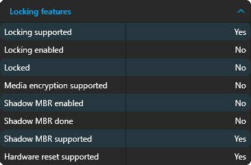
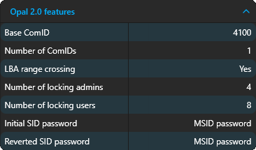

# Introduction

SEDManager is an application for configuring and using self-encrypting drives based on the [TCG storage specifications](https://trustedcomputinggroup.org/work-groups/storage/).

## Supported self-encrypting drives

### TCG Security Subsystem Classes (SSCs)

| SSC          | Support      | Notes                               |
|--------------|--------------|-------------------------------------|
| Enterprise   | Partial      |                                     |
| Opal         | Full         | Versions 1.0 and 2.0 both supported |
| Opalite      | Full         |                                     |
| Pyrite       | Full         | Versions 1.0 and 2.0 both supported |
| Ruby         | Full         |                                     |
| Key Per I/O  | Partial      |                                     |

#### Opal, Opalite, Pyrite, and Ruby devices

Opal, Opalite, Pyrite and Ruby have the same basic concepts, but offer the features at different levels. These devices are fully supported by SEDManager, and you can configure their most important features.

#### Enterprise devices

Enterprise devices differ from the aforementioned specifications by the way they organize users. In Enterprise devices, each user is strictly assigned to a locking range, meaning the permissions users have to locking ranges is fixed. Furthermore, there are no admins and each user is allowed to configure only their own locking range. While adding full support is planned, currently, configuring Enterprise devices is limited to **discovery**, **taking ownership**, **enabling locking**, and **reverting the device**.

#### Key Per I/O devices

Key Per I/O devices use a completely different system. While **discovery**, **taking ownership**, **enabling locking**, and **reverting the device** is supported for KPIO devices as well, there are no current plans on extending support. The KPIO specification is very new, and I haven't heard of any devices that support it.

### Bus interfaces and operating systems

|             | NVMe | SCSI | ATA/SATA |
|-------------|------|------|----------|
| Windows     | Yes  | Yes  | Yes      |
| Linux       | Yes  | No   | No       |
| PBA         | Yes  | No   | No       |

- The PBA environment is based on Linux, and supports the same interfaces
- Support for other operating systems, such as Mac OS or FreeBSD, is not planned
- Support for additional interfaces is planned

:::warning Untested bus interfaces

The following os / bus configurations are available but not tested due to lack of test hardware:
- Windows / SCSI
- Windows / (S)ATA

They may not work properly on real hardware.

:::

## List of available devices

On startup, SEDManager scans the computer for available storage devices. The storage devices are grouped into three categories:
- **Self-encryping drives**: These devices indicate support for hardware-based encryption, and SEDManager display detailed information about their capabilities. SEDs are sorted into the first tabs on the user interface for easy access.
- **Regular drives**: These are the devices that SEDManager cannot encrypt. SEDManager will display basic drive information and the reason that encryption is not available. Usually, either the drive does not support encryption, or SEDManager does not support the drive's bus interface, or some other error occured while collecting information.
- **Unavailable drives**: These are the devices SEDManager failed to open. The most common cause is that you are not running SEDManager as administrator or as root, in which case it cannot get low-level access to the drives. It's also possible that SEDManager does not support the drive's bus interface.

:::info Refreshing the device list

You can manually refresh the list of devices by pressing . This will detect newly connected devices, but it will cancel sessions on all currently open devices.

:::

## Identifying device capabilities

For each device that supports encryption, SEDManager display a detailed list of the device's capabilities.

Common feature sets:
- **TPer features**: Information about the communication protocol the device uses. You can generally ignore it.
- **Locking features**: Information about the current state of encryption and encryption capabilities. This is the most important one to look at.
- **Geometry features**: Gives your information about the alignment requirements of locking ranges. Can be useful when configuring locking ranges.

*Locking features as displayed by SEDManager*

SSC feature sets:
- **Opal 1.0/2.0 features**: If present, your device supports TCG Opal 1.0/2.0.
- **Opalite features**
- **Pyrite 1.0/2.0 features**
- **Ruby features**
- **Enterprise features**
- **Key Per I/O features**

*Opal 2.0 features as displayed by SEDManager*

