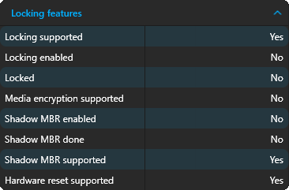
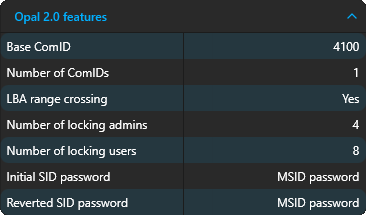

# Introduction

SEDManager is an application for configuring and using **self-encrypting drives** (**SEDs**) based on the [TCG storage specifications](https://trustedcomputinggroup.org/work-groups/storage/). This includes most self-encrypting drives out there today, particularly **TCG Opal** and **TCG Enterprise** drives.

## Which SEDs are supported?

### TCG security subsystem classes (SSCs)

Self-encrypting drives can be categorized by which [SSC](/docs/theory/the_tcg_spec) they implement. SEDManager provides support for the following SSCs:

| SSC          | Support      | Notes                               |
|--------------|--------------|-------------------------------|
| Enterprise   | Partial      |                               |
| Opal         | Full         | Including version 1.0 and 2.0 |
| Opalite      | Full         |                               |
| Pyrite       | Full         | Including version 1.0 and 2.0 |
| Ruby         | Full         |                               |
| Key Per I/O  | Partial      |                               |

#### Opal, Opalite, Pyrite, and Ruby devices

These four SSCs work based on the same principles, but they differ in the features that they implement, and can have varying level of support for a certain feature. SEDManager has full support for these SSCs.

#### Enterprise devices

While Enterprise devices work under the same principles as the aforementioned four, they have a different scheme for managing user permissions, leading to a difference in how locking ranges are configured. While you can configure most aspects of Enterprise drives, you cannot unfortunately edit or erase locking ranges yet.

#### Key Per I/O devices

Key Per I/O devices use a completely different system. While **discovery**, **taking ownership**, **enabling locking**, and **reverting the device** is supported for KPIO devices as well, there are no current plans on extending support.

### Drive bus interfaces

|             | NVMe | SCSI / SAS | ATA / SATA | Notes                                                        |
|-------------|------|------------|------------|--------------------------------------------------------------|
| Windows     | Yes  | Yes        | Yes        |                                                              |
| Linux       | Yes  | No         | No         |                                                              |
| PBA         | Yes  | No         | No         | The PBA is based on Linux, and supports the same interfaces. |

The support for the interface depends not on the physical interface, but rather on what communication protocol the driver uses. As such, a USB device using SCSI commands will still work.

MacOS and FreeBSD are not supported, neither is support planned in the near future.

:::warning Untested bus interfaces

The following os / bus configurations are available but not tested due to lack of test hardware:
- Windows / SCSI
- Windows / (S)ATA

They may not work properly on real hardware.

:::

## Running SEDManager

### Elevated privileges

On Windows, SEDManager needs access to `\\.\PhysicalDrive#N`, whereas on Linux, it needs access to devices such as `/dev/nvme0`. To grant SEDManager access, you can **run it as administrator** on Windows, or **run it as root** on Linux. Technically, SEDManager does not need elevated privileges to anything else, so you can give it fine-grained access only to run IOCTLs on your drives. (I don't know if it's possible on either of the systems.) SEDManager will also happily run as a standard user, but it will display all drives as unavailable due to missing privileges.

### Windows SmartScreen and anti-virus

In some cases, Windows or anti-virus will prevent you from running SEDManager. This is in part due to the fact that I don't have a certificate yet to sign the executables. In general, you can ignore and bypass these warnings. If you're worried that SEDManager does something malicious, you can always check the [source code](https://github.com/petiaccja/sed-manager-rs) yourself.

## List of SEDs in the computer

When launched, SEDManager scans your computer and classifies your drives into three categories:
- **Self-encryping drives** report to SEDManager that they support hardware-based encryption. SEDManager sorts these drives first, display detailed information about their capabilities, and lets you configuring their encryption features.
- **Regular drives** do not support encryption or their encryption capabilities aren't recognized by SEDManager. Basic drive information is displayed alongside the reason as to why the drive cannot be encrypted.
- **Unavailable drives** are drives that SEDManager failed to open. This typically happens when SEDManager doesn't have permission to the devices (i.e. not running with elevated privileges) or it doesn't support the drive's bus interface.

:::info Refreshing the device list

You can manually refresh the list of devices anytime by pressing . This will detect newly connected devices, but it will reset sessions on all currently open devices.

:::

## Identifying device capabilities

For devices that support encryption, SEDManager displays common feature sets and SSC feature sets. Common feature sets provide information about the general capabilities of the device, whereas SSC feature sets tell you which SSC specifications the device supports.

### Common feature sets

- **TPer features**: Describes the device's communication capabilities. Some devices can accept larger messages and support more efficient communication protocols. Knowing the device's capabilities, applications like SEDManager can determine how to best send data to the device. These parameters are not typically important if you just want to set up your drives.
- **Locking features**: By checking the locking feature set, you can learn if your device supports [locking, encryption, and MBR shadowing](/docs/theory/the_tcg_spec.mdx#locking-and-encryption-features). Additionally, if the features are supported, the device also indicates if they are currently turned on.
- **Geometry features**: When configuring [locking ranges](/docs/theory/the_tcg_spec.mdx#locking-ranges), some drives have requirements such as a locking range must start at an LBA divisible by 8. This feature set tells you the alignment requirements of the drive.
- **Block SID authentication features**: Drives can block authentication as the owner if the owner's password hasn't been changed. The feature set tells you the state of the owner's password, as well as whether authentication is currently blocked.

*Locking features as displayed by SEDManager*

### SSC feature sets

The presence of any of the feature sets indicates that the device supports that SSC:
- **Opal 1.0/2.0 features**
- **Opalite features**
- **Pyrite 1.0/2.0 features**
- **Ruby features**
- **Enterprise features**
- **Key Per I/O features**

The information about *ComID*s is needed by SEDManager to establish connection with the device, while other parameters, such as *range crossing* and the *number of users* tell you what the device is capable of within the rules of that SSC.

*Opal 2.0 features as displayed by SEDManager*

